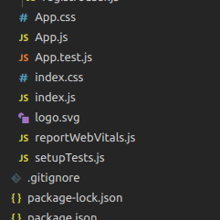
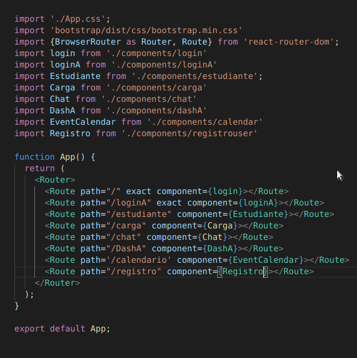
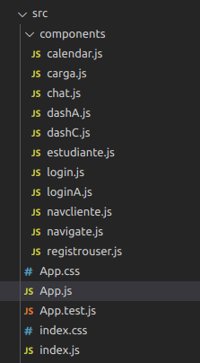

# MANUAL TECNICO/ QUINIELA APP
---------------------------------------------------------------------------
## UNIVERSIDAD SAN CARLOS DE GUATEMALA
## FACULTAD DE INGENIERIA 
## MANEJO E IMPLEMENTACION DE ARCHIVOS

### ERICK VALENZUELA
---------------------------------------------------------------------------

### Lenguajes y herramientas utlizadas proyecto
- Para el backend se utilizo el lenguaje de programación Go (Golang).
- Para el frontend se utilizo el framework web React.
    - HTML5 y CSS para que el sitio sea funcional, atractivo y refleja la imagen de cada entidad.
- Base de datos oracle
---------------------------------------------------------------------------
# REACT (FRONTEND)
React es una librería Javascript focalizada en el desarrollo de interfaces de usuario. Así se define la propia librería y evidentemente, esa es su principal área de trabajo. Sin embargo, lo cierto es que en React encontramos un excelente aliado para hacer todo tipo de aplicaciones web, SPA (Single Page Application) o incluso aplicaciones para móviles. Para ello, alrededor de React existe un completo ecosistema de módulos, herramientas y componentes capaces de ayudar al desarrollador a cubrir objetivos avanzados con relativamente poco esfuerzo. 

## DESCRIPCION DEL PROBLEMA
- se nos pidio realizar un solucion para el app quiniela, dicha app consta de diferentes modulos y roles de usuario que se tendran que encontrar soluciones para que no se mezclen las diferentes paginas realizadas para cada uno de estos roles.
## ASPECTOS DE ANALISIS
- Distribucion de ficheros y contenido de ellos
```
    \Administrador
        \inicio
            -Capital de temporada: Muestra el total de capital para la temporada actual que será puesto en juego.
            -Bronze: Número total de clientes con membresı́a bronze activa en la temporada actual.
            -Silver: Número total de clientes con membresı́a silver activa en la temporada actual.
            -Gold: Número total de clientes con membresı́a gold activa en la temporada actual.
        \carga masiva
        \jornadas
        \temporadas
        \recompensas
        \deportes
        \reportes
    \Cliente
        \Registro cliente
        \login
        \recuperar contraseña
        \perfil de usuario
        \pagar membresia
        \ingresar predicciones
        \navegar en eventos deportivos
            - vista mensual
            - vista semanal
             -- codigo de colores
                --- gris: evento ya ocurrio
                --- morado: evento no a ocurrido pero ya se realizo la prediccion
                --- otros: colores propios por cada deporte
            - restriccion de intento
        \resultados
        \tabla de posiciones
        \recompensas

```
## ESPECIFICACIONES TECNICAS
### Desarrollo de la solucion\
La solucion se debe de desarrollar en un ide adecuado para el lenguaje java script y que soporte la utilizacion del paquete de desarrollo de  REACT JS.\
\
El IDE escojido para el desarrollo de este proyecto de este proyecto es VISUAL CODE.\
VScode es un gran IDE ideal trabajo, ya que admite muchos lenguajes de programación y tiene muchas características que nos ayudaran al desarrollo de la solucion.\
\
También tiene un gran apoyo de su comunidad y tienen gran soporte.

### Programas o herramientas requeridas
    - visual code(VScode)
    - comando npm
    - node js
    - react js

### librerias utilizadas en react
- axios
```
    npm install axios
```
- universal cookies 
```
    install univeral-cookies
```
- react router dom 
```
    intall reat-router-dom
```
- big calendar 
```
    npm install big-calender
```
### DESARROLLO 
- Estructura principal proyecto\
    La estructura principal del proyecto esta integrado por el App.js e Index.js

    Imagen 1
    <p>
    
   </p>
   En el App.js es donde se concentran el manejador de las rutas que estan presentes en nuestro proyecto.
    
   Imagen 2
   <p>
    
   </p>

   La aplicacion esta distribuida en componente, dichos componente se ubican en la carpeta componentes del proyecto, para poder hacer uso de cada uno de estos, como se ve en la imagen no.2 estos primero se tienen que importar, haciendo uso **import COMPONENTE from 'ruta ubacacion del componente'**, y dentro de **funcion App()** se debe utlizar Router para poder otorgar una ruta por la cual se podra tener acceso a travez del navegador. en la siguiente imagen se muestra la ubicacion de los componente dentro de la carpeta del proyecto.

   imagen 3
   <p>
    
   </p>
# API REST GOLANG (BACKEND)
### librerias utilizadas golang
- [github.com/godror/godror](https://github.com/godror/godror)
    - libreria que nos permite realizar la conexion entre nuestro api en go con orale 
 ```
    go get -u github.com/godror/godror
```   

- [github.com/gorilla/mux](https://github.com/gorilla/mux)
    - libreria que no permite volver nuestro app en go en un api rest
 ```
    go get -u github.com/gorilla/mux
```   